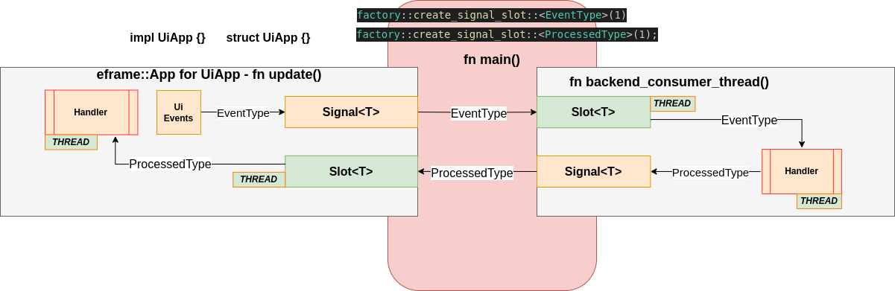

# egui_mobius  
*Because GUI software design is a two sided problem operating on a single surface.*

[](https://github.com/emilk/egui)


[](https://github.com/saturn77/egui_mobius/actions/workflows/rust.yml)

  

**egui_mobius** is a Rust framework designed to facilitate modular
egui applications enabling maintainability and scalability.  

It emphasizes clean architecture with seamless communication between UI and business logic, inspired by the continuous, one-sided nature of the Möbius strip. It is meant to be part of the egui ecosystem of helper crates, but also has other possible front ends.

## Motivation 
In Egui applications, UI and backend logic are often tightly coupled. egui_mobius solves this by providing a structured approach to communication between layers, improving maintainability and scalability. Having core elements of a gui that are portable and maintainble is the ultimate goal.  

## Features  
- Clear separation of UI and business logic.  
- Flexible command and event processing using `std::mpsc`.
- Employ the signals and slots paradigm.   
- Modular design for cleaner, more maintainable code. 
- Portable code for backend processes. 


## Quick Start
There are multiple crates in the repository, and each example
is a crate. Each example has it's own documentation. 

For an example that illustrates the core functionality of 
egui_mobius, it is recommended to check out the ui_refresh_events
example:

```bash
git clone git@github.com:saturn77/egui_mobius.git 
cargo run -p ui_refresh_events
```

## 🧠 Architecture Overview

The core of `egui_mobius` is built around a **bi-directional message flow** between the UI thread and backend logic, using a **signal-slot pattern**. Additionally, various data types support construction of this flow, so that building out an application seems very natural. 

The diagram below shows how `EventType` messages are emitted by the UI and processed in a background thread, which then sends `ProcessedType` results back to the UI:



**Signal<T> / Slot<T>**  pairs are created with a clean API:

```rs
    factory::create_signal_slot::<EventType>(1);
    factory::create_signal_slot::<ProcessedType>(1);
```
These form a thread-safe bridge between the UiApp (**eframe::App for UiApp**) and the backend (**backend_consumer_thread**).

The eframe::App::update() must run on the main/UI thread. Attempting to use async or tokio::main on the main() function of an egui application is problematic. That is why message passing shines as it avoids these issues. 

### UiApp Thread

The eframe::App (fn update) handles UI interactions and emits EventType into the signal. It also listens for ProcessedType results via the corresponding slot. Slots run in their own thread, as indicated in the
diagram. 

### Backend Thread

Consumes EventType from the slot.
Processes events and emits ProcessedType into the signal for the UI to consume.
Threaded Handlers
Both UI and backend run independently, communicating only through signals/slots.

This architecture allows clean separation of concerns, responsive UI, and background processing — *all without needing async runtimes or complex synchronization.*

### Core Type Portability

The **backend_consumer_thread(s)** can be constructed to be portable
and reusable across applications, providing another level of design
reuse by approaching a design with egui_mobius.

## Contributing  
Contributions are welcome! Please fork the repository, create a feature branch, and submit a pull request.  

## License  
This project is licensed under the MIT License.  

## Contact  
For support or questions, open an issue or reach out on [GitHub Discussions](https://github.com/saturn77/egui_mobius/discussions).
