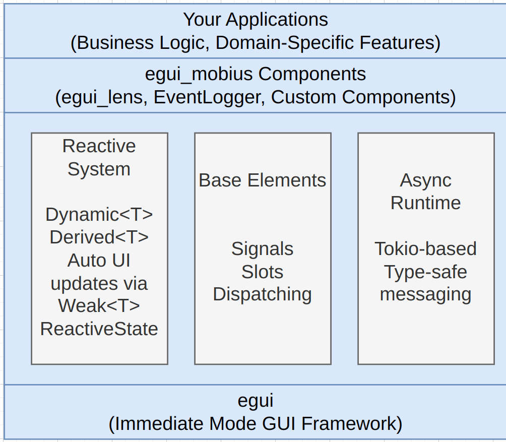

<div align="center">
</img>

# egui_mobius
*Because GUI software design is a two sided problem operating on a single surface.*

[](https://github.com/emilk/egui)
[](https://github.com/Adanos020/egui_dock)
[](https://crates.io/crates/egui_mobius)
[](https://opensource.org/licenses/MIT)
[](https://github.com/saturn77/egui_mobius/actions/workflows/rust.yml)
[](https://saturn77.github.io/egui_mobius/)


</div>

> **📖 [Read the egui-citizen Book](https://saturn77.github.io/egui_mobius/)** —
> a concept-by-concept guide to building organized egui apps with the
> citizen pattern. Covers reactive lifecycle, the dispatcher, `Dynamic<T>`
> internals, coupling paths, dual-wired atoms, stored vs stateless panels,
> common pitfalls, and an API reference.

`egui_mobius` is a comprehensive software stack for building sophisticated
egui applications. It provides the essential layers needed for
production-ready GUI applications: reactive state management, async
operations and dedicated threading, and the **citizen pattern** — a
first-class architecture for dock panels with persistent identity,
reactive lifecycle state, and central message dispatch.

The recommended way to organize a non-trivial egui app on this stack is
the [citizen pattern](https://saturn77.github.io/egui_mobius/). Read the
book for the full story; the rest of this README sketches the moving
parts.

## The citizen pattern in 30 seconds

Each dock panel gets a persistent identity (`CitizenId`), reactive
lifecycle state (`CitizenState`), and participates in message dispatch
through a central `Dispatcher`. State transitions happen exactly once,
on click — not every frame.

```rust
// Register panels at startup
let mut dispatcher = Dispatcher::new();
dispatcher.register(CitizenId::new("freq_watt"));
dispatcher.register(CitizenId::new("volt_watt"));
dispatcher.register(CitizenId::new("plot"));

// In TabViewer::on_tab_button — fires once on click
if response.clicked() {
    dispatcher.activate(&id);  // one-hot: one active, rest off
}

// After DockArea::show — process messages
for msg in dispatcher.drain_messages() {
    match msg {
        CitizenMessage::Activated   { id } => { /* route to panel or backend */ }
        CitizenMessage::Deactivated { id } => { /* cleanup */ }
        _ => {}
    }
}
```

### Core citizen types

| Type | Purpose |
|------|---------|
| `Citizen` | Trait each dock panel implements. Identity + lifecycle hooks. |
| `CitizenState` | Per-panel reactive state: active, clicked, selected, moved, location, visible. |
| `CitizenMessage` | Lifecycle events dispatched through the message queue. |
| `Dispatcher` | Manages citizens. `activate()` is an encoded set/reset. `drain_messages()` for Elm-style dispatch. |
| `CitizenId` | String identifier. Panels are addressed by name. |

### Two consumer paths

Every field in `CitizenState` is a `Dynamic<T>` from `egui_mobius_reactive`.
When the dispatcher calls `state.active.set(true)`, any panel holding a
clone of that state sees the change immediately via `.get()` — no polling,
no message checking, no frame delay. This is what makes two consumer paths
possible:

- **Path A — Other panels** read `CitizenState` directly via `Dynamic<T>`. Reactive, immediate, zero wiring.
- **Path B — Backend threads** receive `CitizenMessage` via `drain_messages()` and route through channels to serial ports, network connections, or compute tasks.

```
Tab click → dispatcher.activate("alpha")
  ├─ Path A: alpha.state.active = true   (reactive, immediate via Dynamic<T>)
  │           beta.state.active = false
  └─ Path B: queue ← [Activated{alpha}, Deactivated{beta}]
             drain_messages() → route to backends
```

## Architecture overview

The diagram below is a general representation of how `egui_mobius` is
organized.

<div align="center">
</img>
</div>

## Ecosystem

The `egui_mobius` framework is a workspace of coordinated crates:

| Crate | Role |
|-------|------|
| **`egui_citizen`** | First-class citizen pattern — dock panel lifecycle, identity, message dispatch. **Recommended way to organize a non-trivial app.** |
| `egui_mobius_reactive` | Thread-safe reactive primitives: `Dynamic<T>`, `Derived<T>`, `SignalRegistry`. |
| `egui_mobius` | Core signal-slot and dispatching system. |
| `egui_mobius_widgets` | Stateful widget toolkit for retained-mode-style composition. |
| `egui_mobius_components` | Higher-level UI components (event logger, etc.). |

## Beyond citizens — the broader stack

### Reactive state management

- Thread-safe reactive primitives via `Dynamic<T>` and `Derived<T>`
- Automatic UI updates when state changes
- Efficient dependency tracking with minimal boilerplate
- Composition-friendly design patterns with `ReactiveWidgetRef`

### Async runtime

- Background processing that keeps your UI responsive
- Type-safe message passing between threads
- Built on Tokio for reliable async operations
- Seamless integration with the reactive system

### Modular architecture

- Signal-slot system for clean separation of UI and business logic
- `MobiusWidget` traits for encapsulated, reusable UI elements
- Scalable patterns for complex applications
- Stateful components that maintain their own lifecycle

## Built with `egui_mobius`

Real applications running on this stack:

- **[CopperForge](https://github.com/Atlantix-EDA/CopperForge)** — KiCad companion tool for project management, gerber viewing, and fabrication output. 12 citizen panels, LayerStore-based rendering.
- **saturn-grid-sim** — IEEE 1547 grid support algorithm simulator with freq-watt, volt-watt, volt-var, and watt-var panels, live serial telemetry, and modbus TCP register access to embedded FPGA hardware.
- **[quarri](https://github.com/saturn77/quarri)** — Quartus FPGA toolchain launcher with dark theme injection and multi-installation management.
- **[diskforge](https://github.com/saturn77/egui_lens/tree/master/examples/diskforge)** — SD card formatting application built on `egui_lens`.
- **[egui_lens](https://github.com/saturn77/egui_lens)** — Reactive event logger component built on `egui_mobius_reactive`.

## Getting Started

Read the [egui-citizen book](https://saturn77.github.io/egui_mobius/) for
the concept-by-concept guide. Or jump straight to a runnable example:

```bash
# Citizen pattern
cargo run -p citizen_dock          # citizen + egui_dock, three panels
cargo run -p citizen_fetch         # backend threading with HTTP fetch
cargo run -p getting_started       # smallest possible citizen example

# Reactive / async / signal-slot
cargo run -p clock_reactive        # modern reactive UI with minimal boilerplate
cargo run -p clock_async           # thread-aware async with clean UI feedback
cargo run -p reactive_slider       # ReactiveWidgetRef composition
cargo run -p logger_component      # event logger for sophisticated tracking
```

For a full project skeleton, see the [template repository](https://github.com/saturn77/egui_mobius_template).

## Contributing

- Contributions welcome! Fork the repository, create a feature branch, and submit a pull request.
- Licensed under the MIT License.
- For support or questions, open an issue or reach out on [GitHub Discussions](https://github.com/saturn77/egui_mobius/discussions).
