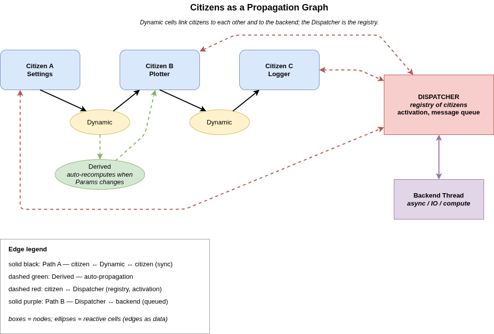

# Coupling

Panel-to-panel coupling is what shared `Dynamic<T>` already gives you:
one panel writes, another reads, `egui` redraws on the next frame.
Most apps need nothing more than that to get state from one panel to
another. This chapter calls that **Path A**, and it is the default.

There is also an opt-in second path — `dispatcher.send()` — for the
specific case where a state change needs to leave the UI thread or
land on a queue: a backend thread, an off-thread logger, a persistence
sink, anything that wants events rather than just the current value.
That's **Path B**. Most of this chapter exists to keep its trade-offs
straight from Path A's, because conflating the two is where designs
go sideways.

A single widget — what we'll call an **atom** (a widget inside a
citizen panel) — can use either path or both at once.

| Path | Mechanism           | Good for                    | Timing           |
|------|---------------------|-----------------------------|------------------|
| A    | Shared `Dynamic<T>` | Panel ↔ panel (default)     | Immediate        |
| B    | `dispatcher.send()` | Panel → backend / logger    | Next drain pass  |

## Path A — shared `Dynamic<T>` (panel to panel)

Two panels share a clone of the same `Dynamic<T>`. One writes, the
other reads. That's the whole mechanism.

```rust,ignore
// settings_panel.rs
struct SettingsPanelState {
    pub slider_value: Dynamic<f32>,
}

// logger_panel.rs
struct LoggerPanelState {
    pub observed_slider: Dynamic<f32>, // clone of settings.slider_value
}
```

The two `Dynamic<f32>` handles point at the same `Arc<Mutex<f32>>`.
When `settings` calls `.set(...)`, the write lands in shared memory.
When `logger.ui()` runs on the next frame and calls `.get()`, it sees
the new value.

No subscription, no callback, no event bus. egui already redraws
frequently enough that polling-per-frame is effectively free. **Path A
carries state, not events.**

## Path B — dispatcher messages (panel to backend, opt-in)

The settings panel explicitly enqueues a message; the app's update
loop drains it after `DockArea::show()` and forwards it onward — to a
backend thread, a logger sink, a persistence layer.

```rust,ignore
// In settings_panel.rs, when the slider changes:
dispatcher.send(AppMessage::SliderChanged(local));

// In App::update(), once per frame:
for msg in dispatcher.drain_messages() {
    match msg {
        AppMessage::SliderChanged(v) => tx_backend.send(v).unwrap(),
        // ...
    }
}
```

**Path B carries events, not state.** Each `.send()` enqueues one
record; `drain_messages()` consumes the queue. Nothing is "shared" —
the message is a value, not a handle.

> **Aside on `Dynamic::on_change`.** `egui_mobius_reactive` does
> provide a callback-style subscription on `Dynamic<T>` itself, which
> looks superficially like a third coupling option. It is — but it
> spawns one OS thread per subscriber, has no unsubscribe API, and
> doesn't coalesce wakeups. For most `egui_citizen` apps, Path B
> through the dispatcher is the better way to do "react off the UI
> thread when this value changes." The full mechanics live in
> [Inside `Dynamic<T>`](inside-dynamic.md).

## Atoms can wire to both

A single atom can fan out to both paths from the same user event. The
fan-out happens at the change handler:

```rust,ignore
if ui.add(Slider::new(&mut local, 0.0..=100.0)).changed() {
    self.slider_value.set(local);                       // Path A
    dispatcher.send(AppMessage::SliderChanged(local));  // Path B
}
```

This is a common and correct pattern. The atom is the **single write
site**; each path is a derived consequence of the one event. Readers
on Path A see the new value next frame; consumers on Path B get the
message on the next drain cycle.

### When dual wiring is right

Dual-wire an atom when a change needs to:

- Update shared UI state, **and**
- Trigger side-effect work (log it, persist it, send it to a backend
  thread, recompute a derived value off-thread).

Single-path atoms are fine when the change only needs one of those.
Don't dual-wire out of habit — extra messages with no consumers are
noise.

## Source-of-truth discipline

The trap: once an atom writes to both paths, downstream code can read
*from either one* and the two representations can drift. Pick a
discipline and hold it.

**Discipline 1 — `Dynamic<T>` is canonical, the message is a ping.**

```rust,ignore
dispatcher.send(AppMessage::SliderChanged);  // no value in the message!
// Consumers re-read `settings.slider_value.get()` when the message arrives.
```

Consumers of the message reach back into shared state for the current
value. This guarantees consistency — there is exactly one value, the
one in the `Dynamic<f32>`. The message says only "something happened,
go look."

**Discipline 2 — Message carries the value, `Dynamic<T>` is a UI mirror.**

```rust,ignore
dispatcher.send(AppMessage::SliderChanged(local));
```

The message is the canonical record of the event. The `Dynamic<f32>`
exists only so other panels can render the current value without
intercepting messages. Consumers of the message trust the message and
do not re-read the `Dynamic`.

Either discipline works. **Mixing them silently** — some consumers
trusting the message, others reading the `Dynamic` — is where bugs
live.

## Timing

Within a single frame, the two paths do not tick in lockstep:

- **Path A is instant.** `.set(v)` returns after writing; any panel
  calling `.get()` on a clone sees `v` immediately.
- **Path B is queued.** `.send(msg)` appends to the dispatcher's queue;
  consumers don't see it until the update loop calls
  `drain_messages()`.

Backend threads therefore observe the Path B message *after* the UI
has already observed the Path A value. For typical use (the backend
does work and replies asynchronously), that one-frame gap is
invisible. For anything tighter — a dependency on in-frame ordering
between UI and backend — you need to redesign, not lean harder on
this.

## The dispatcher is *not* a reactive bus

Worth saying explicitly, because it is the mistake everyone makes
coming from other reactive systems:

> The dispatcher does not observe `Dynamic<T>` writes.

It only knows about the `CitizenState` fields it registered, and its
queue only fills from `activate()` and explicit `send()`. Your
slider's `Dynamic<f32>` on `SettingsPanelState` is invisible to it
until the panel explicitly bridges the two paths with a `.send()`
call.

Shared state (Path A) and dispatcher messages (Path B) **compose** —
they don't **chain** automatically.

## Citizens as a propagation graph

Step back from the mechanism for a moment. What shape does an
`egui_mobius` application actually have at runtime?

It's a **graph**. Citizens are the nodes; `Dynamic<T>` cells are
the edges; the dispatcher is a registry that knows about every
node but does not itself carry data between them.



Three propagation modes ride this graph:

- **Adjacent.** A citizen writes `Dynamic<T>`, an adjacent citizen
  reads it on the next frame. Sync, in-frame, no queue. This is
  Path A from the previous section. Two panels sharing a slider
  value, a selection set, a cursor position — that's adjacent
  propagation. Topology is whatever clones share the same
  `Arc`-backed cell; siblings, cousins, however far apart in the
  panel tree, all see the same value.

- **Forward.** A `Derived<T>` cell wraps a `Dynamic<T>` and
  recomputes automatically when the input changes. The new value
  flows downstream to whoever holds a clone of the `Derived`. This
  is the chain in the graph: input cell → derived cell → readers.
  Useful when one citizen owns the source-of-truth state and other
  citizens want a transformation of it without each computing the
  same transform locally.

- **Outbound.** A citizen calls `dispatcher.send()`; a backend
  thread reads the queue. Async, queued, next-drain. This is Path
  B. The graph extends past the UI thread out to whatever does the
  heavy lifting — IO, compute, network — and the backend's
  responses come back through the same queue.

The combination matters. Most reactive frameworks bind state to a
component lifetime: state lives inside the widget tree, and
sharing across siblings means lifting up or threading context. The
`egui_mobius` model inverts that. `Dynamic<T>` cells are
free-standing reactive nodes anyone can hold a clone of —
including backend threads that don't have an egui context at all.
The widget tree borrows the cells; it doesn't own them. That's
why the same primitive that wires Settings to Plotter also wires
Plotter to a Tokio task.

The neural-network analogy is approximate but useful. A citizen
graph propagates values to adjacent neighbours through cells and
forward through derived chains. The dispatcher is more like a
directory than a layer; it doesn't compute, it doesn't transform,
it just knows who's plugged in and routes lifecycle and outbound
events. The actual data movement happens through the cells.

## Summary

- Two coupling paths. **Path A** for UI-to-UI state sharing (shared
  `Dynamic<T>`). **Path B** for UI-to-backend events
  (`dispatcher.send()` + `drain_messages()`).
- Atoms can wire to one path or both. Fan-out happens at the write
  site, not downstream.
- Dual-wired atoms require a source-of-truth discipline: `Dynamic`
  canonical with the message as a ping, or message canonical with the
  `Dynamic` as a UI mirror. Don't mix.
- Path A is in-frame; Path B lands at the next drain. Backend threads
  see changes one frame after the UI does.
- The dispatcher is a lifecycle registry plus an explicit outbound
  queue. It is not an automatic observer of reactive state.
