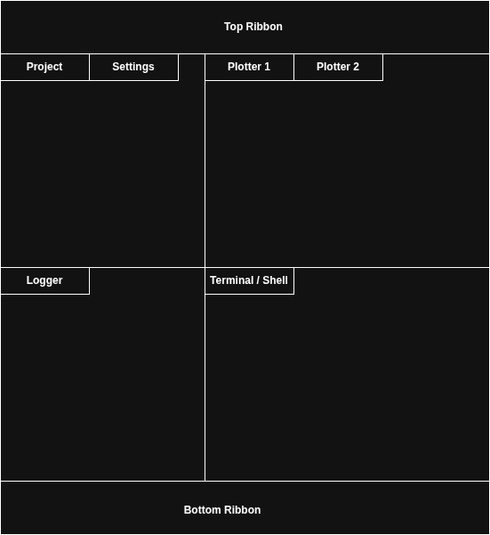

# Introduction

You have an `egui_dock` app with three panels and they keep fighting over
state. Two panels both render every frame, both write to the same `bool`,
and whichever rendered last wins. You add a "currently active panel"
field somewhere; every panel polls it and tries to react to changes.
The polling code multiplies. Adding a fourth panel means touching three
existing ones.

`egui_citizen` fixes this. It gives each panel a persistent identity,
reactive lifecycle state, and a central dispatcher that routes
activation through an encoded set/reset — exactly one panel active at
a time, atomically, no per-frame races.

But the panel race is just the entry point. egui itself is, by design,
a primitive — its own README is direct about that:

> egui is *not* a framework. egui is a library you call into, not an
> environment you program for.
>
> — [egui README](https://github.com/emilk/egui)

That is true and intentional. It also leaves an obvious gap. The egui
community has produced excellent individual components, but a kit of
components is not a framework. There is no widely adopted opinionated
way to *organize* a non-trivial egui app — where state lives, how
panels coordinate, how the UI talks to backend threads.

One of those individual components deserves explicit recognition.
[`egui_dock`](https://crates.io/crates/egui_dock) is the key piece of
the egui ecosystem that lets a non-trivial app look and feel
*finished* — multi-panel docking, splittable workspaces, drag-and-drop
tab rearrangement, persistent layouts. It plays roughly the same role
in the egui world that the **Qt Advanced Docking System** plays in Qt:
without it an app tends to feel like a demo, and with it an app can
feel professional.



*A typical multi-panel app layout. Every labelled region is a
candidate citizen-panel; the ribbons are app-shared chrome.*

But `egui_dock` is, by intent, a layout and interaction primitive — not
an organizational framework. It hands you the shell. It does not tell
you how the panels living inside that shell should share state,
coordinate activation, or reach a backend. Wiring those decisions is
left to the application author, which is precisely what this book —
and `egui_citizen` — are about.

`egui_citizen` fills that gap. It is, in practice, **a framework for
organizing egui apps** — clean, reusable, and easily expandable.
Persistent identity, reactive state, and central message dispatch form
a small composable kit of building blocks that scale as the app grows.
It evolved from `egui_mobius` in direct response to that ecosystem
gap (the [Lineage section](#lineage) covers the technical
inheritance); CopperForge and other real applications are built
end-to-end on these primitives.

This book teaches the design vocabulary and the non-obvious rules. By
the end you should know:

- Where each piece of state in your app belongs (`CitizenState`,
  panel-local fields, or app-shared services).
- What "reactive" actually means in this codebase, and what cloning
  a `CitizenState` does (and doesn't) do.
- When to keep panels stored on your app struct vs. construct them
  per-frame — and which trap will silently break the second form.
- How to forward citizen lifecycle events to backend threads without
  the UI having to know about them.

> **Who this book is for**
>
> Rust developers building dockable egui applications. Familiarity with
> egui itself is assumed — this book is not a tutorial on `egui::Ui` or
> `egui_dock`. It is a guide to using `egui_citizen` to organize a real
> app on top of those.

## Key vocabulary

Three terms appear throughout this book. Fix them in your head now —
every chapter that follows leans on these:

- **citizen-panel** — a dock panel that carries a persistent identity
  ([`CitizenId`](concepts/citizen.md)) and reactive lifecycle state
  ([`CitizenState`](concepts/state.md)), wired into a central
  [`Dispatcher`](concepts/dispatcher.md). The citizen-panel is the
  unit of organization in an `egui_citizen` app.
- **atom** — a single widget inside a citizen-panel: a slider, a
  button, a text field, a checkbox. Atoms are where user input
  originates. They fire events on their citizen-panel's behalf and
  often hold their own reactive state that other panels or backend
  threads read. See the
  [coupling chapter](concepts/coupling.md) for how an atom can wire
  into panel-to-panel state sharing, panel-to-backend messaging, or
  both at once.
- **`Dynamic<T>`** — the reactive primitive that citizen-panels and
  atoms both sit on top of. A thread-safe, observable cell that any
  number of handles can point at. Writes through any handle are
  visible through every other handle. Covered in depth below.

## Lineage

`egui_citizen` evolved from
[`egui_mobius`](https://github.com/saturn77/egui_mobius), a broader
reactive framework for egui. It now stands as its own architectural
framework, with one piece of that lineage retained as a hard
dependency: the
[`egui_mobius_reactive`](https://crates.io/crates/egui_mobius_reactive)
crate, specifically its `Dynamic<T>` type.

## The `Dynamic<T>` primitive

Before going further, know the one building block that everything
reactive in `egui_citizen` rests on:

> **Every reactive field in `egui_citizen` is a `Dynamic<T>`.**

### What it is

A `Dynamic<T>` is a thread-safe, observable container for a single
value. Internally (quoting `egui_mobius_reactive` verbatim):

```rust,ignore
pub struct Dynamic<T> {
    inner: Arc<Mutex<T>>,
    notifiers: Arc<parking_lot::Mutex<Vec<Sender<()>>>>,
}
```

Two `Arc`s. The first holds the value behind a standard `Mutex`. The
second holds a list of channel senders used to wake subscribers when
the value changes. `Dynamic<T>` derives `Clone` — cloning bumps the
refcount on each `Arc` and copies nothing else, so every clone refers
to the **same** storage and the **same** notifier list.

> **Aside: `Clone` in Rust is per-type.** Rust has no language-level
> default of "deep" vs. "shallow" — each type's `Clone` impl decides
> what cloning means for that type.
>
> - Owned types like `String`, `Vec<T>`, `Box<T>`, `HashMap<K, V>`
>   duplicate their heap data on `.clone()` — what C++ would call a
>   deep copy.
> - Reference-counted types like `Arc<T>` and `Rc<T>` are *documented*
>   to clone as a refcount increment — a new handle pointing at the
>   same allocation. C++ would call this shallow.
>
> `Mutex<T>` itself does not implement `Clone` at all — that is why
> the `Arc` wrapper is necessary. Cloning a `Dynamic<T>` is therefore
> exactly two `Arc::clone` calls: two refcount bumps, zero data
> duplication. The shared storage is not an accident; it is the
> precise contract of `Arc`.

### Core API

```rust,ignore
use egui_mobius_reactive::Dynamic;

let counter = Dynamic::new(0);      // construct
let n = counter.get();              // read (clones T out of the lock)
counter.set(42);                    // write, then notify listeners
let mut guard = counter.lock();     // direct MutexGuard if you need it
*guard += 1;
```

- `Dynamic::new(initial)` — requires `T: Clone + Send + 'static`.
- `get()` — returns a *clone* of the value; the lock is released
  before you work with the result.
- `set(value)` — takes the lock, writes, drops the lock, then sends
  `()` into every registered notifier channel.
- `lock()` — gives you a raw `MutexGuard` for in-place mutation. Other
  readers and writers block until you drop the guard.

### Observing changes

Reading on every frame works — that's what UI panels do via `.get()`
in their render methods. For event-driven work, `ValueExt::on_change`
registers a callback that fires on every mutation:

```rust,ignore
use egui_mobius_reactive::{Dynamic, ValueExt};

let counter = Dynamic::new(0);
counter.on_change(|| println!("changed!"));

counter.set(1); // prints "changed!"
counter.set(2); // prints "changed!"
```

Under the hood, `on_change` spawns a dedicated background thread that
waits on the notifier channel. The callback runs off the UI thread —
which is why `T` needs `Send + Sync + PartialEq + 'static` for this
path. The full mechanics — including what it actually costs per
subscriber and why the canonical reactive path inside `egui_citizen`
is panel-side polling rather than callbacks — get a chapter of their
own: [Inside `Dynamic<T>`](concepts/inside-dynamic.md).

### Why this shape matters for `egui_citizen`

Because clones share storage, a `CitizenState` — a bundle of
`Dynamic<T>` fields — is a **handle**, not an owned value:

```rust
use egui_citizen::CitizenState;

let a = CitizenState::new();
let b = a.clone();

a.active.set(true);
assert!(b.active.get());  // true — same Arc<Mutex<bool>>
```

The dispatcher keeps one clone of each citizen's state; your panel
holds another. When the dispatcher writes `.active.set(true)`, your
panel sees `true` on its next `.get()`. No event bus, no subscription
to wire up, no polling loop — just a shared `Arc`.

### Permissive type, disciplined use

`Dynamic<T>` itself is **multi-producer, multi-consumer** — any clone
can call `.set()`, any clone can `.get()`. The type doesn't restrict
who writes.

`egui_citizen` layers a **single-writer-per-field** discipline on top:

| Field                         | Canonical writer                  |
|-------------------------------|-----------------------------------|
| `active`                      | The `Dispatcher` (via `activate`) |
| `clicked`                     | The panel's `on_click` hook       |
| `selected`, `visible`, `moved`| The panel or app-level code       |
| `location`                    | The dock-integration layer        |

Readers are unrestricted: any panel, any backend thread. Writers are
by convention, not enforcement. This is why the dispatcher is central
(it's the one place that serializes activation writes across all
citizens), and why the [pitfall on two dispatchers in one
app](pitfalls.md) exists — two writers to the same logical field break
the one-hot invariant.

Keep to "one writer per field" and the reactive story stays clean;
violate it and you're back to the per-frame race the crate was built
to avoid.

### Where it sits in the wider crate

`egui_mobius_reactive` also provides `Value<T>` (an older API with the
same idea), `Derived<T>` (computed values that recalculate when their
inputs change), and a `SignalRegistry` for app-wide signal wiring.
`egui_citizen` uses only `Dynamic<T>`, so that is all this book
covers. If you later want a `Derived<T>` that reads a `CitizenState`
field and recomputes downstream, the reactive crate's own documentation
is the next stop.

The chapter on [reactive lifecycle](concepts/state.md) builds on this
foundation and walks through the trap that bites users who construct a
`CitizenState` with `CitizenState::default()` instead of obtaining one
from `Dispatcher::register()`.
