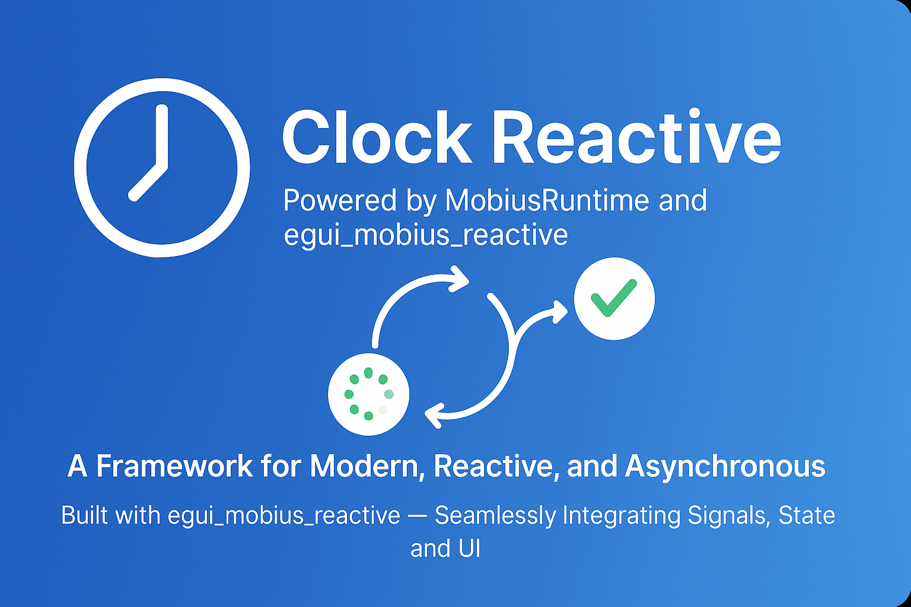

# **Clock Reactive Example**

The `clock_reactive` example demonstrates the power of combining **`egui_mobius_reactive`** and the new **async runtime (`MobiusRuntime`)** to build modern, reactive, and asynchronous applications with a clean and modular architecture.



This example showcases how to:
- Use the **`MobiusRuntime`** for managing asynchronous event-driven workflows.
- Leverage **`egui_mobius_reactive`** for reactive state management and seamless integration with the `egui` GUI framework.
- Build a **framework for modern apps** that are both **reactive and asynchronous.**

---

## **Features**

- **Asynchronous Runtime**:
  - The `MobiusRuntime` provides a flexible and scalable async runtime for handling events and tasks.
  - Built on top of `tokio`, it supports non-blocking operations and clean shutdown mechanisms.

- **Reactive State Management**:
  - The `egui_mobius_reactive` crate enables reactive state updates, ensuring that UI components automatically respond to changes in application state.

- **Modular Architecture**:
  - Events are routed dynamically using the `EventRoute` trait, allowing for clean separation of concerns.
  - Handlers are registered by route, making it easy to extend and maintain the application.

- **Real-Time Clock Example**:
  - The `clock_reactive` example demonstrates a real-time clock that updates every second, showcasing the integration of async tasks with reactive state updates.

---

## **Framework Advantages**

While this is an example, this is also a framework that is designed for developing
modern applications that often require: 

- **Asynchronous workflows**: Handle events, tasks, and background operations without blocking the UI.
- **Reactive state management**: Automatically update the UI in response to state changes.
- **Scalability**: Modular design makes it easy to extend and maintain.

Whether you're building a dashboard, a real-time monitoring tool, or any other interactive application, this framework provides the tools you need to succeed.

---

## **How It Works**

### **1. MobiusRuntime**
The `MobiusRuntime` is an async runtime that manages event-driven workflows. It:
- Routes events dynamically using the `EventRoute` trait.
- Allows you to register async handlers for specific event routes.
- Provides clean shutdown mechanisms for graceful termination.

### **2. egui_mobius_reactive**
The `egui_mobius_reactive` crate integrates reactive state management with the `egui` GUI framework. It:
- Enables seamless two-way binding between application state and UI components.
- Simplifies the process of building reactive UIs.

### **3. Clock Example**
The `clock_reactive` example combines these two components to create a real-time clock:
- The `MobiusRuntime` periodically emits a `Tick` event.
- The `egui_mobius_reactive` state is updated in response to the `Tick` event.
- The UI automatically updates to display the current time.

---

## **Getting Started**

### **1. Clone the Repository**
```bash
git clone https://github.com/your-repo/egui_mobius.git
cd egui_mobius/examples/clock_reactive
```

### **2. Build and Run**
Ensure you have Rust installed, then run:
```bash
cargo run --example clock_reactive
```

### **3. Explore the Code **
- **`main.rs`**: Entry point for the application.
- **`runtime.rs`**: Implementation of the `MobiusRuntime`.
- **`state.rs`**: Reactive state management using `egui_mobius_reactive`.

---

## **Code Highlights**

### **Registering Event Handlers**
Handlers are registered with the `MobiusRuntime` using the `register_handler` method:
```rust
runtime.register_handler("tick", move |_event| {
    let state = state.clone();
    async move {
        state.update_time();
    }
});
```

### **Reactive State Updates**
The `egui_mobius_reactive` crate ensures that UI components automatically respond to state changes. For example, the `formatted_time` value is derived reactively from `current_time` and `use_24h`:

```rust
let deps = [
    Arc::new(current_time_clone) as Arc<dyn ReactiveValue>,
    Arc::new(use_24h_clone) as Arc<dyn ReactiveValue>
];
let formatted_time = Derived::new(
    &deps,
    move || {
        let time = current_time_clone_2.get();
        let use_24h = use_24h_clone_2.get();
        if use_24h {
            time.clone()
        } else {
            time.trim_start_matches('0').to_string()
        }
    }
);
```

This ensures that whenever `current_time` or `use_24h` changes, the `formatted_time` value is automatically updated, and the UI reflects the new state.

---

## **Future Directions**

This framework is a foundation for building modern, reactive applications. Future enhancements may include:
- **Advanced state management**: Support for more complex state hierarchies.
- **Improved performance**: Optimizations for large-scale applications.
- **Additional examples**: Demonstrating use cases like real-time data visualization and multi-threaded workflows.

---

## **Contributing**

We welcome contributions! If you have ideas for improvements or new features, feel free to open an issue or submit a pull request.

---

## **License**

This project is licensed under the MIT License. See the LICENSE file for details.

---

Let me know if you'd like further refinements or additional details! 🚀