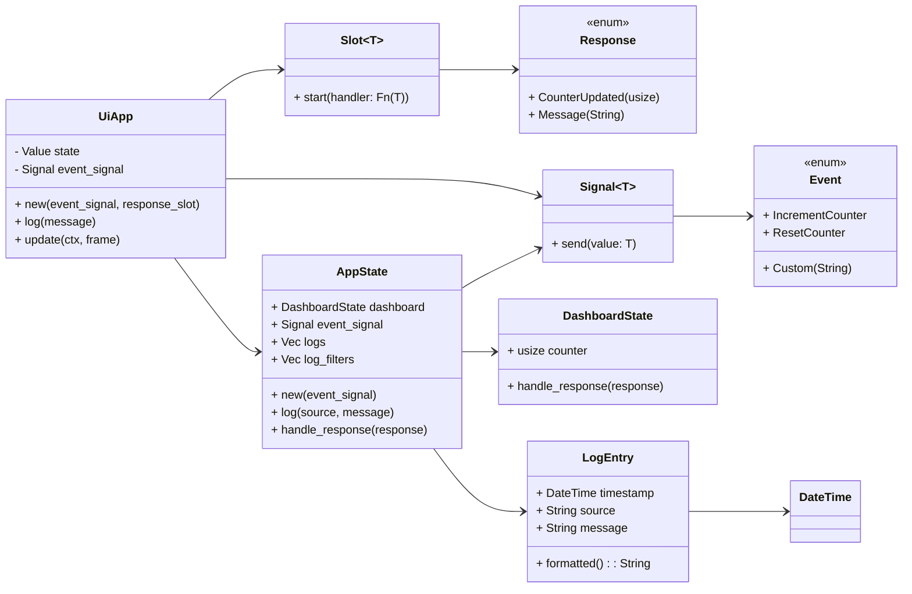
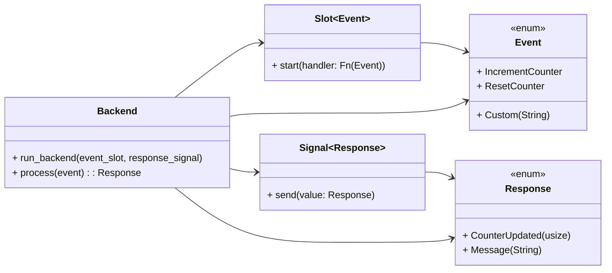
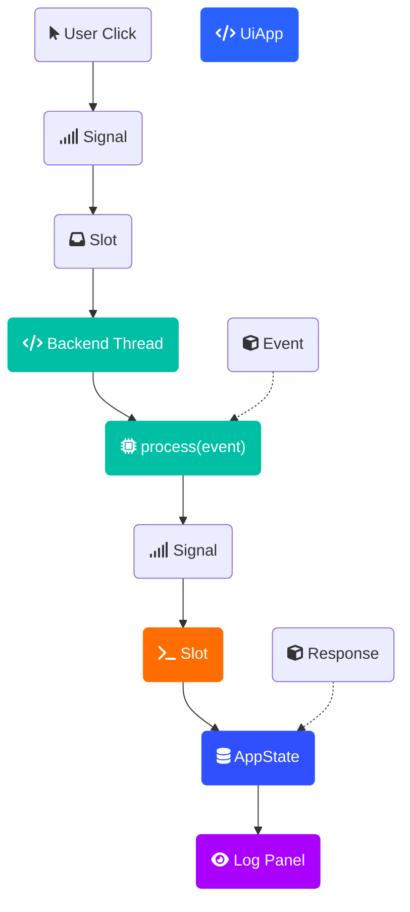

# Dashboard with egui_mobius

## Overview

This Rust-based application demonstrates an interactive dashboard UI built with `egui_mobius`. It features asynchronous backend event processing, real-time logging, and efficient state management using Rust's concurrency primitives.

## Features

- Increment and reset a numeric counter via UI buttons.
- Real-time, thread-safe logging of UI and backend events.
- Filterable logs panel (by UI or backend).
- Scrollable and selectable logs panel with text copying.
- Persistent log storage (`ui_session_log.txt`).

## Architecture

- **UI (`egui`)**: Handles user interactions and sends events.
- **Event and Response Messaging**: Asynchronous communication between frontend and backend using `Signal<Event>` and `Slot<Response>`.
- **Backend Thread**: Processes events, manages application state, and provides logs.
- **State Management**: `AppState` wrapped safely in `egui_mobius::types::Value<T>` (thread-safe, mutex-protected, and reference-counted).

The system implements a reactive UI that communicates with a background thread using signals and slots to handle application state updates.

---

## UML Diagram – UI Layer and Messaging Interface



---

## UML Diagram – Backend Thread and Event Processing



---

## Flowchart of Design



---

## Features Recap

- Increment and reset counter with immediate backend response.
- Log panel with filter by source (`ui` or `backend`).
- Scrollable, selectable logs supporting copy-paste.

## Running the Application

```bash
cargo run -p dashboard
```

## Dependencies

- `eframe`
- `egui_mobius`
- `chrono`
- `lazy_static`
- `log`
- `env_logger`

## Log Persistence

Logs are automatically persisted to `ui_session_log.txt`.