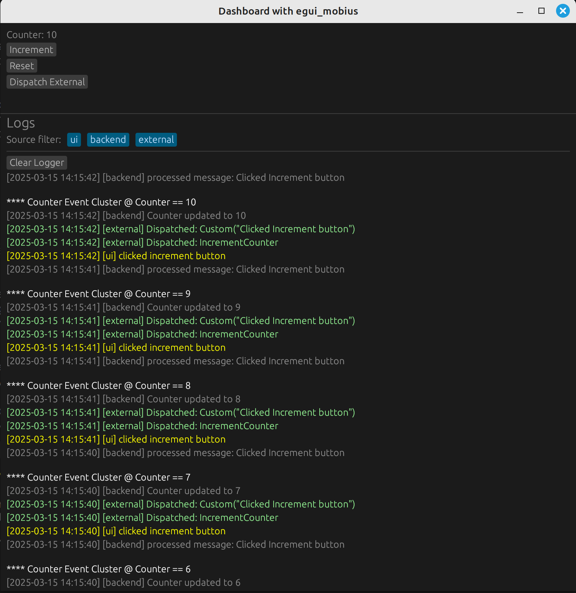

# Dashboard with egui_mobius

## Overview

This example demonstrates modular communications and messages of `Events` and `Responses` within the GUI.

```bash
cargo run -p dashboard
```

There is the ui portion that is sending events, the backend which is processing these events into Response<T> or Procssed<T> messages, and the `Dispatcher` which can register slots and send signals to anywhere in the application. 


The application consists of:

- UI (UiApp): Responsible for rendering the user interface and sending events to the backend.
- Backend: Processes events into Response<T> messages and sends them back to the UI.
- Dispatcher: Registers slots and sends signals to facilitate communication between the UI and backend.

The screenshot below shots an internal log of a "Counter Event" where the ui, backen, and `Dispatcher` are logging their actions accordingly.




## Features

- Increment and reset a numeric counter via UI buttons.
- Real-time, thread-safe logging of UI and backend events.
- Filterable logs panel (by UI, backend, Dispatcher).
- Persistent log storage (`ui_session_log.txt`).

Understanding AppState vs UiApp
In this example, two key structures, AppState and UiApp, play distinct roles in managing the application's state and behavior. Below is a detailed explanation of their responsibilities and how they interact:

## 1. AppState
   
`AppState` is the **centralized state container** for the application. It holds the data that represents the current state of the application, such as the counter value, logs, and log filters. It is designed to be thread-safe and is shared across different parts of the application.

Key Responsibilities
- **State Management**: Stores the application's state, such as the counter (DashboardState), logs, and log filters.
- **Logging**: Handles logging of events and messages from various sources (e.g., UI, backend, external).
- **Response Handling**: Processes responses from the backend and updates the state accordingly.

```rust 
#[derive(Clone)]
pub struct AppState {
    pub dashboard: DashboardState, // Holds the counter state
    pub logs: Vec<LogEntry>,       // Stores log entries
    pub log_filters: Vec<String>, // Filters for log display
}

impl AppState {
    pub fn log(&mut self, source: &str, message: String) {
        // Logs messages to a file and stores them in memory
    }

    pub fn handle_response(&mut self, response: Response) {
        // Updates the state based on backend responses
    }
}

```

## 2. UiApp

`UiApp` is the **UI controller for the application.** It is responsible for rendering the user interface and handling user interactions. It acts as a bridge between the UI and the backend by sending events and receiving responses.

Key Responsibilities
- **UI Rendering**: Defines the layout and behavior of the user interface using egui.
- **Event Dispatching**: Sends events (e.g., button clicks) to the backend using the Dispatcher.
- **Response Listening**: Listens for responses from the backend and updates the AppState accordingly.

```rust
pub struct UiApp {
    dispatcher: Dispatcher<Event>, // Handles event dispatching
    state: Value<AppState>,        // Shared application state
}

impl UiApp {
    pub fn new(mut response_slot: Slot<Response>, dispatcher: Dispatcher<Event>) -> Self {
        // Initializes the UI app and sets up response handling
    }

    pub fn log(&self, message: String) {
        // Logs messages from the UI
    }
}

impl eframe::App for UiApp {
    fn update(&mut self, ctx: &egui::Context, _frame: &mut eframe::Frame) {
        // Renders the UI and handles user interactions
    }
}
```

How They Work Together

1. UiApp Sends Events:
  
  When a user interacts with the UI (e.g., clicks a button), UiApp sends an event to the backend using the Dispatcher.

2. Backend Processes Events:
  
  The backend processes the event and sends a response back to the UiApp.

3. UiApp Updates AppState:
  
  The response is passed to AppState, which updates the application state (e.g., counter value, logs).

4. UiApp Renders Updated State:
  
  The updated state is reflected in the UI during the next render cycle.

## Example Workflow

### Increment Counter

1. User Action:

The user clicks the "Increment" button in the UI.

2. Event Dispatch:

UiApp sends an Event::IncrementCounter to the backend using the Dispatcher.

3. Backend Processing:

The backend increments the counter and sends a Response::CounterUpdated back to the UiApp.

4. State Update:

AppState updates the counter value and logs the event.

5. UI Update:

UiApp renders the updated counter value in the UI.