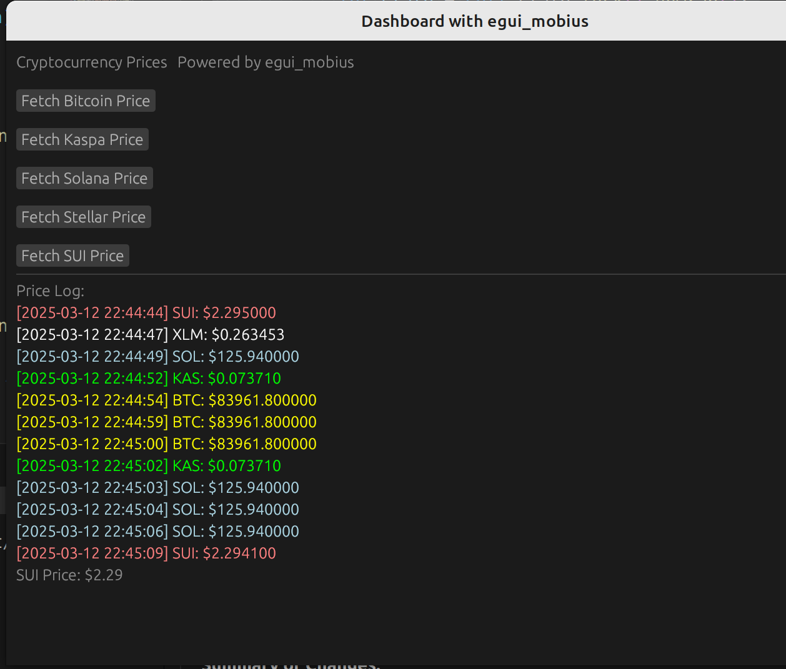

# `dashboard_async` 

Demonstrating `async` within egui_mobius !

```bash
cargo run --example dashboard_async
```

This example builds an asynchronous dashboard application using [`egui_mobius`](https://github.com/saturn77/egui_mobius), `egui`, and `eframe`. It fetches real-time cryptocurrency prices from Kraken and displays them in a responsive, state-driven GUI.

In introduces a new key component to the envisioned egui_mobius framework - the `Dispatcher` whic his repsonsibles for listening 
for EventTypes on a Slot, then assigning tasks to a tokio runtime
for execution. 

The key features are: 

- The introduction of the `Dispatcher` function  
- Async background tasks handled using `tokio::runtime`
- Fetch prices for various crypto's
- Live color-coded price log using `egui::ScrollArea`
- Shared UI state with `Value<AppState>` for safe cross-thread access

Overall this demo established the `egui_mobius` framework as async based on the backend, while maintaining sync on the frontend. Note
that there is no tokio::main decoration applied to the main function !

## Architecture

- **UI Layer (`UiMainWindow`)**
  - Sends EventType messages to the Dispatcher via Signal<Event>
  - Runs a Slot<Processed> to receive messages from Dispatcher
- **State (`AppState`)**
  - Holds the most recent coin prices
  - Handles the Signal<Processed> type messages
  - Tracks loading state and logs all updates 
- **Dispatcher**
  - Listens for incoming event messages from UiMainWindow via `Slot<Event>`
  - Spawns tasks on a shared `tokio::Runtime`
  - Sends price updates back to UiMainWindow Slot via `Signal<Processed>`


## Screenshot

Just press the desired cryptocurrency button, and the price will be 
fetched through the Dispatcher & tokio to be displayed as shown ! 



## License

MIT 

