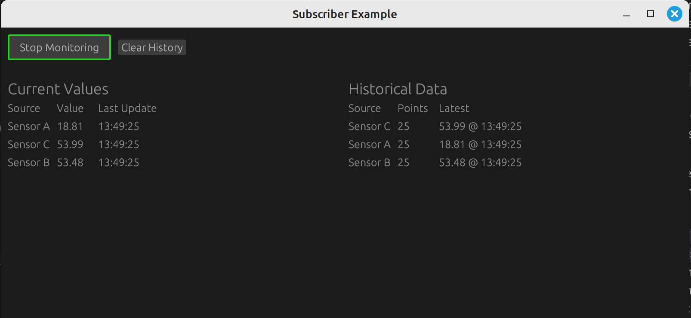

# Subscriber Example

This example demonstrates the use of a complete subscription model in egui_mobius, where multiple UI components can independently **subscribe to and react to events** using a Qt-inspired signal-slot architecture. This
is basically a complete Elm architecture. 

```bash
cargo run --example subscriber
```

The AsyncDispatcher is a thread-safe event dispatcher that allows UI components to subscribe to and react to events. It is a key component of the subscriber pattern in egui_mobius. Basically, Slots are "registered" with the dispatcher and are called when the corresponding signal is emitted.

The Dispatcher then sends Processed<T> signals back to the subscriber.
The Updatable trait is used to update the UI components with the processed events. The Updateable trait is implemented by the ChartView and TableView components, and is pretty powerful to connect the dispatcher to the UI components. The `egui_mobius` dispatching.rs module does not currently have
a generic Updateable trait, but plans are for there to be one. For now, 
the Updateable trait is implemented right in application. 

The screenshot below shows the subscriber example in action. The example demonstrates how multiple UI components can independently subscribe to and react to events and how to handle background tasks and proper task cancellation.

Pressing Stop will stop the background task and clear the history, and pressing Start will resume the background task. Overall, there are two views
of the same data: a table and a chart. This is the
essence of the subscriber pattern.



## Features

- **Thread-Safe State Management**: Uses `Value<T>` for thread-safe state sharing between UI components
- **Independent Subscribers**: Table and Chart views independently subscribe to data updates
- **Real-time Updates**: Simulates sensor data updates with configurable refresh rate
- **Monitoring Control**: Start/Stop monitoring with visual feedback
  - Green outline indicates active monitoring
  - Red outline indicates monitoring is stopped
- **History Management**: Clear historical data with a single click

